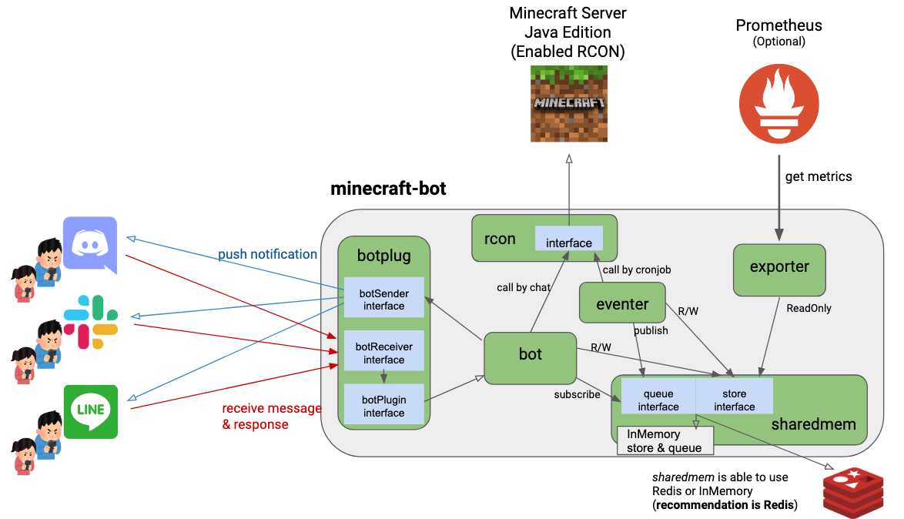

minecraft-bot
===


minecraft-bot has the following features.

* **notification Bot** : notify Minecraft login/logout events to some chat-tool (LINE/Slack/Discord)
* **operation of Minecraft whitelist** : operate to whitelist of Minecraft Server through ChatBot
* **Prometheus exporter** : support some Minecraft metrics in Prometheus exporter format
* **source is only RCON** : minecraft-bot is not required any Mod, not required reading Minecraft world data, only using RCON

## Demo

* operate by chat & Login/Logout notification to chat


* using multi chat platform


### Dashboard

* using `./dashboard/minecraft_users.json`
    * pre-install `vonage-status-panel` Panel Plugin


## Installation

* only download binary from [release](https://github.com/ShotaKitazawa/minecraft-bot/releases)

* or execute bellow command

```
go get -u github.com/ShotaKitazawa/minecraft-bot/cmd/minecraft-bot
```

## Usage

```
$ minecraft-bot -h
Usage of minecraft-bot:
  -f string
        TOML configuration filepath
  -v    show application version
```

* TOML Configuration File

```
# Minecraft Server Hostname (requirement)
minecraft-hostname = "your_domain"

# basic setting (option)
bind-addr = "0.0.0.0"  # default: "0.0.0.0"
bind-port = 8080       # default: 8080
log-level = "info"     # default: "info",  support "debug", "info", "warn", or "error"


[bot]
# bot basic Configuration (option)
notification-mode = "XXX"  # default: "all", support "none", or "all"

[[bot.line]]
# LINE Bot Configuration (requirement)
endpoint = "/linebot"
channel-secret = "XXX"
channel-token = "XXX"

# LINE Bot Configuration (option)
group-ids = "XXX"  # default: none, cannot push notification without this


[[bot.slack]]
# Slack Bot Configuration (requirement)
token = "XXX"

# Slack Bot Configuration (option)
channel-ids = "XXX"  # default: none, cannot push notification without this


[[bot.discord]]
# Discord Bot Configuration (requirement)
token = "XXX"

# Discord Bot Configuration (option)
channel-ids = "XXX"  # default: none, cannot push notification without this


[rcon]
# connect in RCON to Minecraft (option)
host = "127.0.0.1"    # default: "127.0.0.1"
port = 25575          # default: 25575

# RCON password (requirement)
password = "XXX"


[sharedmem]
# place to store state (support "redis" (recommended), or "local")
mode = "redis"        # default: "local"


[sharedmem.redis]
# Redis info (option if sharedmem.mode == "redis")
host = "127.0.0.1"    # default: "127.0.0.1"
port = 6379           # default: 6379
```

### Execution example

* enable one LINE Bot belong to 2 Groups
* using Redis in sharedmem
* minecraft-bot, Minecraft, Redis exist in the same server

```
$ cat config.toml
minecraft-hostname = "your_domain"

[[bot.line]]
endpoint = "/linebot"
channel-secret = "XXX"
channel-token = "XXX"
group-ids = "GROUP1,GROUP2"

[rcon]
password = "XXX"

[sharedmem]
mode = "redis"
```

* enable two LINE Bot & one Slack Bot, each belong to 1 group
* using Redis in sharedmem
* minecraft-bot, Minecraft, Redis exist in the same server

```
$ cat config.toml
minecraft-hostname = "your_domain"

[[bot.line]]
endpoint = "/linebot"
channel-secret = "XXX"
channel-token = "XXX"
group-ids = "XXX"

[[bot.line]]
endpoint = "/test"
channel-secret = "XXX"
channel-token = "XXX"
group-ids = "XXX"

[[bot.slack]]
token = "XXX"
channel-ids = "XXX"

[rcon]
password = "XXX"

[sharedmem]
mode = "redis"
```

## Required pre-setup

### Minecraft Server Setup

In your Minecraft `server.properties`, make sure you have and restart the server.

```
enable-rcon=true
rcon.password=[minecraftRconPassword]
rcon.port=[minecraftRconPort]
```

### setup Bot for LINE

* Setup LINE `Messageing API` : https://developers.line.biz/console/
    * Webhook URL: `https://<your_domain>/<bot.line.endpoint>`

* Look up GroupID
    1. run bot without `group-ids` of `[[bot.line]]` in config.toml
    2. chat `!id` in specified group
    3. check response of `GroupID: XXX`
    4. postscript `group-ids` of `[[bot.line]]` in config.toml & re-run bot

### setup Bot for Slack

* Setup Slack Bot & Get `Bot User OAuth Access Token` : https://api.slack.com/apps/

* Look up GroupID
    1. run bot without `group-ids` of `[[bot.slack]]` in config.toml
    2. chat `!id` in specified group
    3. check response of `GroupID: XXX`
    4. postscript `group-ids` of `[[bot.slack]]` in config.toml & re-run bot

### setup Bot for Discord

* Setup Slack Bot & Get Bot `TOKEN` : https://discord.com/developers/applications/

* Look up GroupID
    1. run bot without `group-ids` of `[[bot.discord]]` in config.toml
    2. chat `!id` in specified group
    3. check response of `GroupID: XXX`
    4. postscript `group-ids` of `[[bot.discord]]` in config.toml & re-run bot

### Bot needs to support HTTPS separately

This bot run HTTP server, but Webhook configuration required HTTPS in most chat-provider.
Please following the below.

* using HTTPS reverse-proxy server (nginx, Caddy, etc..) & run Bot beside Minecraft server
* using PaaS (Heroku, Google App Engine, etc..)
    * not recommended (RCON connection is not crypted)

## Architecture



